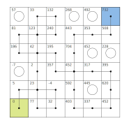
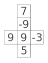

# Die Agony

The path of the dice starting from the yellow square and ending on the blue square is the following:

.

This leaves 7 unvisited squares, with a sum of 1935, which is the solution of the puzzle.

The value of the faces of the die at the starting position are:

.
